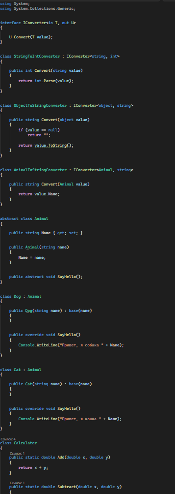
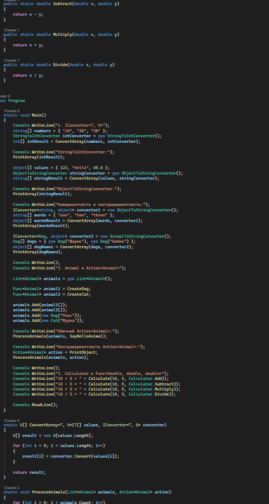
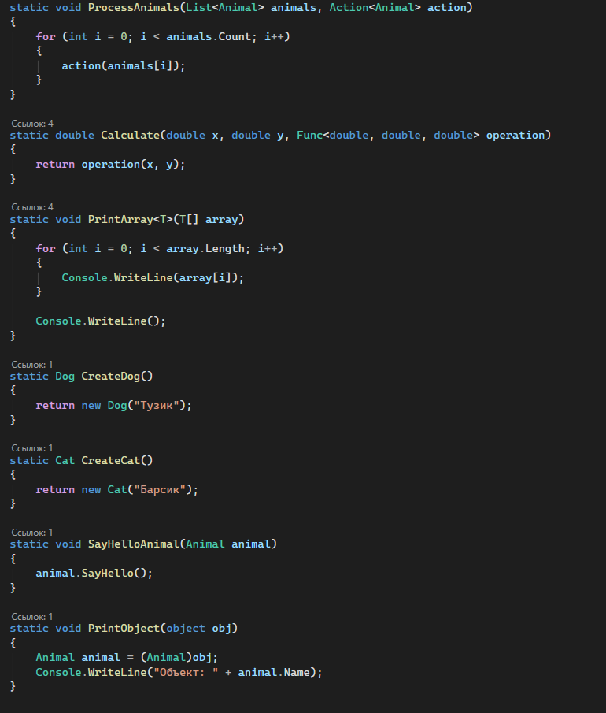
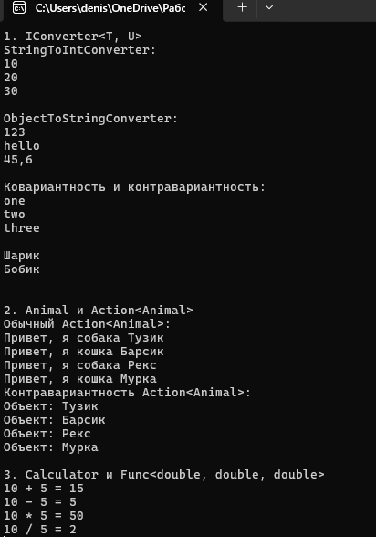

# C# KT7

Источник:
https://professorweb.ru/my/csharp/charp_theory/level10/10_3.php

1. Напишите интерфейс IConverter<T, U>, который содержит метод U Convert(T value). Затем напишите классы StringToIntConverter и ObjectToStringConverter, которые реализуют этот интерфейс для конвертации строк в целые числа и объектов в строки соответственно. Затем напишите метод, который принимает на вход массив значений типа T и делегат типа IConverter<T, U> и возвращает массив значений типа U, полученных путем применения делегата к каждому элементу массива. Продемонстрируйте использование ковариантности и контрвариантности при передаче различных конвертеров в этот метод.

2. Напишите абстрактный класс Animal, который содержит свойство Name и абстрактный метод void SayHello(). Затем напишите классы Dog и Cat, которые наследуются от класса Animal и реализуют метод SayHello() так, чтобы он выводил на консоль приветствие от животного с его именем. Затем напишите метод, который принимает на вход список животных типа List<Animal> и делегат типа Action<Animal> и вызывает этот делегат для каждого животного из списка. Продемонстрируйте использование ковариантности и контрвариантности при передаче различных делегатов в этот метод.

3. Напишите класс Calculator, который содержит статические методы для выполнения арифметических операций над двумя числами типа double: double Add(double x, double y), double Subtract(double x, double y), double Multiply(double x, double y) и double Divide(double x, double y). Затем напишите метод, который принимает на вход два числа типа double и делегат типа Func<double, double, double> и возвращает результат выполнения делегата над этими числами. Продемонстрируйте использование ковариантности и контрвариантности при передаче различных методов калькулятора в этот метод.

### Код

### Результат

